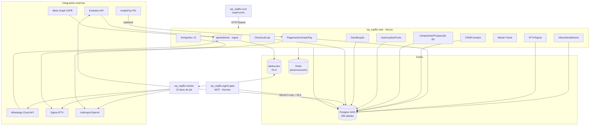

# MAPA OFICIAL DO SISTEMA — Shark Panel (Zapflix-Tech)

> **Versão:** 2026-07-07 · Substitui o mapa de 2026-06-23 (`docs/ARQUITETURA.md`).
> **Método:** auditoria fresca de 100% do codebase por 8 agentes paralelos read-only (código morto, duplicação, estrutura, bugs latentes, performance, segurança, observabilidade/dívida, inventário) + dump do schema e `pg_stat` do banco de produção (read-only, porta 5433).
> **Este é o mapa de referência canônico.** Qualquer sessão futura do Claude Code deve ler este arquivo primeiro. Existe cópia idêntica em `shark-ia-private/Shark-Panel/mapas/`.

---

## 1. O que é o Shark Panel

SaaS **multi-tenant** que reúne num produto só: **atendimento WhatsApp** (inbox multi-atendente), **revenda de IPTV** (provisionamento no painel Sigma), **cobrança PIX** (gateway AmploPay), **prospecção B2B em massa** sobre a base da Receita Federal (~170M linhas), **automações/funis/chatbot/IA de vendas**, e um **painel master** com revendedores, gamificação e feature flags por workspace.

**Arquitetura ampla e rasa:** rotas com SQL cru (`pg`), isolamento multi-tenant **só na aplicação** (sem RLS no Postgres — um `WHERE workspace_id` esquecido vaza dados), fila **baseada em tabela Postgres** (`jobs` + `FOR UPDATE SKIP LOCKED`, **não BullMQ**) consumida por um worker Node separado.

**Domínios em produção:** app.sharkpanel.com.br (tráfego real → serviço `wp_zapflix-web`), sharkpanel.com.br (apex, mesmo app), mcp.sharkpanel.com.br (gateway MCP de agents externos → `wp_zapflix-agent-gate`).

---

## 2. Números reais (verificados em 2026-07-07)

| Métrica | 2026-06-23 | **2026-07-07** | Fonte |
|---|---|---|---|
| Rotas de API (`route.ts`) | 805 | **899** | `find app/api -name route.ts` |
| Páginas (`page.tsx`) | 161 | **184** | `find app -name page.tsx` |
| Componentes React | ~1.537 arq TS | **235** (`components/`) | find |
| Tabelas Postgres (prod) | 249 | **285** | information_schema |
| Migrations | — | **186** | `ls migrations/` |
| Tipos de job do worker | — | **22** | switch em `apps/worker/src/worker.ts` |
| Diretórios de cron | — | **38** (6 sem agendador) | `ls app/api/cron/` |
| Integrações externas | — | **~20** | ver §7 |

**Tabelas maiores (linhas reais):** rf_empresas 67,7M · rf_simples 48,5M · rf_estabelecimentos 38M · rf_prospeccao_mat 15,4M · webhook_token_audit 515K · messages 506K · **audit_logs 4,6M reais** (n_live_tup defasado mostra 269K) · instance_health_log 169K · processed_events 119K · worker_runs 96K.

---

## 3. Stack

Next.js 16 (App Router) · React 19 · TypeScript strict · PostgreSQL 17 (`:5433`, `pg` cru via `lib/db.ts`) · Redis (presence/rate-limit/cache — **jobs NÃO passam por Redis**) · **NextAuth v5.0.0-beta.30** (Credentials/JWT; migração Supabase→NextAuth concluída em 2026-07-06) · Anthropic Claude (Shark Agent, AI Assistant) + OpenAI/OpenRouter (embeddings, transcrição, suggest) · MinIO/S3 · Docker Swarm + Traefik + EasyPanel.

**Três processos/apps distintos:**
- **`wp_zapflix-web`** — app Next.js principal (deploy manual via `scripts/deploy-web.sh`; auto-build Easypanel DESATIVADO).
- **`wp_zapflix-worker`** — worker Node (`apps/worker/`) consumindo a tabela `jobs` (auto-build Easypanel path-scoped, ~60s).
- **`wp_zapflix-agent-gate`** — app MCP separado (`apps/agent-gate/`, Express + McpServer, porta 8787) em mcp.sharkpanel.com.br.
- **`checkout/`** — app Vite + tRPC separado (checkout white-label).

---

## 4. Diagrama de módulos

**Roteamento inbound (prioridade no worker `handlers/webhook.ts`):** Conversational Flow → Chatbot → Guided Funnel ativo → Flow interceptor → Funnel keyword → Marketplace agent → AI Agent.

---

## 5. Inventário de módulos

| Módulo | Rotas API principais | Páginas | Tabelas-chave | Saúde |
|---|---|---|---|---|
| **Inbox/Atendimento** | inbox, internal-chat, preset-messages, scheduled-messages, presence, sse | inbox | conversations, messages, conversation_tags, conversation_transfers, internal_messages | 🟢 Ativo (core) |
| **Instâncias WhatsApp** | instances, whatsapp, rotation, webhook | whatsapp-instances | whatsapp_instances, instance_health_log, instance_metrics, rotation_logs | 🟢 Estável |
| **IPTV/Sigma** | iptv, sigma, trial, admin/apps | iptv, iptv-apps, iptv-plans, trials, sigma | iptv_trials, iptv_servers, iptv_app_configs, sigma_servers, sigma_plan_mapping | 🟢 Ativo (negócio) |
| **Pagamentos/Financeiro** | payments, iptv/payments, pix, recorrencia, renewal | financeiro, cobranca-rapida, recorrencia | payments, subscriptions, checkout_orders, commission_settings | 🟡 Dívida (webhook 2000 linhas) |
| **Checkout/Loja** | checkout, store, store-products, products, orders, lowticket | checkout, store, netflix-store, pedidos | checkout_config, checkout_orders, store_products, lowticket_* | 🟢 Estável |
| **CRM/Contatos** | crm, contacts, tags, kanban, search | crm, contacts, kanban, tags | contacts, contact_tags, crm_pipelines, customer_journey | 🟡 Contatos ativo / CRM estagnado |
| **Campanhas/Prospecção B2B** | campaigns, cnpj, ad-campaigns | campanhas, ad-campanhas, meta-ads | campaigns, rf_empresas, rf_estabelecimentos, prospect_lists, bulk_send_* | 🟢 Ativo |
| **Automações/Funis/Follow-ups** | automations, followup, funnel, guided-funnels, reengagement | automacoes, guided-funnels, funil-vendas, reengajamento | automations, funnels, guided_funnels, followup_* | 🟢 Estável |
| **Chatbot** | chatbot | chatbot | chatbot_flows, chatbot_sessions, jobs | 🟢 Área mais ativa (24 tipos de node) |
| **IA/Agentes (5 subsistemas)** | master/ai-agents, sales-brain, ai-assistant, ai, ai-studio, knowledge | sales-brain, ai-assistant, ai-studio | ai_agents, sales_brain_insights, ai_assistant_pending_actions, agent_audit_log | 🟢 Ativo (ver §6) |
| **Gamificação/Créditos** | gamification, credits, goals, team | gamification, metas, meu-desempenho, team | agent_commissions, agent_xp_log, credit_store_items, employee_payroll | 🟢 Ativo |
| **Master Panel** | master, admin, workspaces, feature-access, monitoring, metrics | admin, users, workspaces-map, monitoring | workspaces, workspace_plans, feature_access, module_trials | 🟢 Ativo (hoje) |
| **Resellers/Afiliados** | resellers, reseller, affiliates, links, r | resellers, reseller-dashboard, links | resellers, reseller_credit_ledger, short_links, link_clicks | 🟢 Resellers / 🔴 Affiliates abandonado |
| **Grupos** | groups, grupos | groups (grupos morto) | whatsapp_groups, group_messages | 🟡 Estagnado |
| **Tickets/Suporte** | tickets, saas-tickets, nps | tickets, nps, help | tickets, saas_tickets, nps_responses | 🟢 Estável |
| **SMS (Grizzly)** | sms | sms | sms_activations, verification_sms | 🟢 Novo/ativo |
| **Instagram/Facebook/Meta** | instagram, facebook, meta/connections, meta/comments, meta/consultor | instagram, meta-ads, meta-ads-expert, meta-expert | ig_conversations, fb_conversations, workspace_meta_connections, meta_advisor_* | 🟡 Em construção |
| **Webchat** | webchat, webchat-settings | webchat-settings, webchat-docs | webchat_sessions, webchat_settings, webchat_plans | 🟢 Estável |
| **Portal do cliente** | portal/[slug] | — | usa contacts/payments/iptv_trials | 🔴 Estagnado + IDOR (ver §6) |
| **Knowledge base** | knowledge (RAG), knowledge-base (simples) | knowledge | knowledge_bases/documents/chunks, knowledge_base, troubleshooting_guides | 🟡 Dois sistemas coexistem |
| **Relatórios/Analytics** | analytics, reports, metrics, dashboard | analytics, relatorios, dashboard | instance_metrics_daily, dashboard_config | 🟢 Estável |
| **Notificações/Alertas** | notifications, alerts, worker-alerts | — | notification_* (4), telegram_alert_configs | 🟢 Novo (2026-07-06) |
| **Verificação / Temp-email** | verification, temp-email | verificacao, temp-email | verification_sessions, temp_mailboxes | 🟡 Novo (envs Mailcow ausentes em prod) |
| **Compliance/Audit/Onboarding** | compliance, audit-log, onboarding | — | compliance_events, audit_logs, workspace_onboarding | 🟢 Funcional |

**Novo desde 2026-06-23:** `apps/agent-gate/` (MCP), AI Assistant embutido (`lib/ai-assistant/`), consultor Meta Ads, master/agentes-externos, DMs Instagram/Messenger com funis, verificação, temp-email, SMS Grizzly, sistema de notificações/Telegram, knowledge-base simples. **14 tabelas novas** (agent_audit_log, agent_guard_events/limits, agent_snapshots, agent_permissions, ai_assistant_pending_actions, ai_decisions_log, notification_* ×4, telegram_alert_configs, knowledge_base, troubleshooting_guides).

---

## 6. Os 5 subsistemas de IA (fonte recorrente de confusão)

1. **ai_agents (legado, prompt-stuffing)** — `app/api/master/ai-agents/`; responde inbound (Priority 5, `handlers/ai.ts`); sem tools; roda em produção.
2. **Shark Agent (Mastra + Anthropic)** — `apps/worker/src/mastra/shark-agent.ts`; 6 tools (buscar_planos, buscar_info_contato, buscar_knowledge_base, abrir_ticket_suporte, aplicar_tag, gerar_link_pagamento); claude-haiku-4-5; invocado por `handleAIAgentResponse` (Priority 7).
3. **Sales Brain** — `app/api/sales-brain/` + `lib/sales-brain/pipeline.ts` + worker `sales-brain-signals.ts`; shadow mode deployado 2026-07-06.
4. **AI Assistant embutido** — `lib/ai-assistant/`; Claude Sonnet; Fase 1 read-only; execução gateada (auto_approve/execution_enabled); **executa SQL do LLM sem isolamento de workspace** (ver achado S-M).
5. **agent-gate / MCP (Hermes)** — app separado; Fase 1 read-only ATIVA; role Postgres `mcp_hermes` SELECT-only + RLS RESTRICTIVE + whitelist versionada + audit hash-chain + circuit breaker.

---

## 7. Integrações externas

| Integração | Propósito | Código | Verificação de origem |
|---|---|---|---|
| Evolution API | WhatsApp não-oficial | `lib/whatsapp/send.ts`, worker (fetch direto) | `x-webhook-token` global (não timing-safe) |
| WhatsApp Cloud API | WhatsApp oficial Meta | `lib/whatsapp/send.ts`, `app/api/webhook/cloud` | ⚠️ **POST sem assinatura** |
| Meta Graph (IG/FB) | DMs, comentários, OAuth | `lib/meta-api.ts`, `lib/ig-funnel-engine.ts` | ⚠️ **POST sem X-Hub-Signature-256** |
| Sigma IPTV | Provisionamento IPTV | `lib/sigma/provision.ts` | — |
| AmploPay | Gateway PIX (única) | `lib/payments/amplopay.ts` | ✅ token `timingSafeEqual` |
| Anthropic | Shark Agent, AI Assistant | `lib/ai/get-anthropic-client.ts` | — |
| OpenAI / OpenRouter | Embeddings, transcrição, DALL-E, suggest | `lib/rag/embeddings.ts` | — |
| ElevenLabs | TTS | `app/api/elevenlabs` | — |
| Grizzly SMS | Números virtuais | `lib/grizzly-sms.ts` | webhook público |
| Mailcow + IMAP | Temp-email | `lib/mailcow.ts`, `lib/imap.ts` | ⚠️ envs ausentes em prod |
| MinIO/S3 | Mídia | `lib/s3.ts` | — |
| Telegram | Alertas + deploy-watchdog | `lib/notifications/telegram-alerts.ts` | — |
| API externa legada | Integrações via API key | `lib/external-auth.ts` | ⚠️ **fallback `uniflix2026`** |
| mcp.sharkpanel.com.br | Gateway MCP (Hermes) | `apps/agent-gate/` | role SELECT-only + RLS |

Sem Stripe/MercadoPago/Asaas. Supabase: só resquícios (auth migrada).

---

## 8. Fluxos críticos (caminhos de arquivo reais)

### 8a. Venda/Trial IPTV → Pagamento → Sigma → Comissão
1. Trial criada: `app/api/iptv/trials/route.ts:374` → `sold_by_user_id = session.user.id` gravado **na criação**.
2. Ativação Sigma: `lib/sigma/provision.ts:243` (`provisionSigmaCustomer`).
3. Pagamento/conversão: `app/api/iptv/payments/route.ts:100` → **vendedor = `trial.sold_by_user_id || session.user.id`** (regra crítica; NUNCA usa só a sessão do admin) → `INSERT payments 'confirmed'` → `UPDATE iptv_trials 'converted'`.
4. Comissão: `lib/gamification.ts:143` (`recordSaleCommission`).

### 8b. Pagamento PIX (AmploPay)
1. Geração: `app/api/checkout/create-pix/route.ts` → `createPixCharge()` (`lib/payments/amplopay.ts:84`).
2. Webhook: `app/api/payments/amplopay-webhook/route.ts:809` — valida token (timingSafeEqual).
3. TRANSACTION_PAID (`:1150`): idempotência check-then-insert em `external_id` (⚠️ **sem UNIQUE — race, achado B-C3**).
4. **Tudo síncrono no handler HTTP** (~2000 linhas): Sigma `:1453`, tags `updateContactAfterPayment` `:478`, mensagem WhatsApp com credenciais `:1996`, comissão `:1736`, Meta Pixel `:36`.

### 8c. Mensagem WhatsApp inbound
1. Webhook Evolution (`app/api/webhook/route.ts`) ou Cloud (`app/api/webhook/cloud/route.ts`): valida token, resolve workspace, tx `INSERT processed_events` (idempotência) + `INSERT jobs (process_webhook)`.
2. Worker `handlers/webhook.ts`: persiste contato/conversa/mensagem; roteamento por prioridade (ver §4).
3. Outbound: jobs `send_*` → `lib/whatsapp/send.ts` (⚠️ há call-sites legados no worker chamando Evolution direto — origem do bug "instância errada").

### 8d. Chatbot
- Trigger `matchesTrigger` → sessão `chatbot_sessions` → **24 tipos de node** (`handlers/chatbot.ts:528+`).
- Timeout/resume: cron `chatbot-timeout` (1/min, 5min padrão / 2h se trial ativa).
- Escalação: node `transfer_to_agent` (`conversations.status='pending'`) ou node `ai_response` (`askAgent`).

### 8e. Worker
Tabela `jobs` no Postgres, claim `FOR UPDATE SKIP LOCKED` (`worker.ts:57`), reaper 10min, retry com backoff, feature-flag por tipo. Sem BullMQ. 22 tipos de job. POLL_INTERVAL 2s.

---

## 9. Crons (38 diretórios, 3 disparadores)

- **A) `wp_zapflix-cron`** (supercronic → `run-crons.sh` → `curl` com `Bearer $CRON_TOKEN`): a cada 1min (scheduled-messages, process-bulk-send, expire-conversation-locks, follow-up-leads, chatbot-timeout); 5min (check-webhook-tokens, check-worker-alerts, funnel-processor, drip-event-triggers); 15min (check-instance-health, drip-campaigns); horário/diário/semanal/mensal (ver inventário completo).
- **B) crontab do host**: trial-followup, promote-expired-trials, expire-conversation-locks (REDUNDANTES), backup, check-worker-health, deploy-watchdog.
- **C) setInterval no worker**: 10 loops, vários TAMBÉM redundantes com os crons HTTP.
- **⚠️ 6 rotas cron SEM agendador:** `auto-close-conversations`, `cleanup-module-trials`, `daily-summary`, `pix-pending-tagger`, `sync-meta-comments`, `tag-refollow`. Além de **`db-retention` e `cleanup-audit-logs` não agendados** (achados P-C4 / D-C1).

---

## 10. Achados da auditoria (Fases 1-2) — priorizados

**Legenda:** 🔴 Crítico · 🟡 Médio · ⚪ Cosmético. Tipos: Bug / Segurança / Performance / Observabilidade / Duplicação / Desorganização / UX / Dívida.

### 🔴 CRÍTICOS (agir primeiro)

| # | Tipo | Local | Problema |
|---|---|---|---|
| B-C1 | Bug (cross-tenant) | `app/api/campaigns/[id]/recipients/route.ts:34` | Lista `campaign_recipients` só por `campaign_id`, sem workspace. `getWorkspaceIdSafe` importado e nunca usado. **Enumera telefones/nomes de outros tenants.** |
| B-C2 | Bug (cross-tenant) | `app/api/inbox/conversations/[id]/delete/route.ts:26` | 3 DELETEs (webchat_sessions/ai_agent_logs/ai_agent_conversations) por `conversation_id` sem workspace, ANTES do delete guardado. **Destrói dados de outro tenant** se o id for alheio. |
| B-C3 | Bug (race/dinheiro) | `app/api/payments/amplopay-webhook/route.ts:1153` | Idempotência check-then-insert sem `UNIQUE` em `payments.external_id`. Webhooks duplicados → **pagamento/comissão em dobro**. Fix: UNIQUE parcial + `ON CONFLICT DO NOTHING`. |
| S-C1 | Segurança | `lib/external-auth.ts:3` | Fallback hardcoded `?? 'uniflix2026'` (valor real igual). Qualquer request com `x-api-key: uniflix2026` lê pedidos/métricas de workspace fixo. Rotacionar + remover fallback. |
| S-C2 | Segurança | `webhooks/facebook:64`, `webhooks/instagram:68`, `webhook/cloud:96` | POST de eventos Meta sem validar `X-Hub-Signature-256`. Injeção de mensagens/postbacks falsos. |
| S-C3 | Segurança | `master/agentes-externos/revoke/route.ts:31` | Kill-switch `ALTER ROLE NOLOGIN` **sem guard de superadmin** — qualquer usuário logado derruba o Hermes. |
| S-C4 | Segurança | `master/agentes-externos/reset-breaker/route.ts` | Idem, sem guard de superadmin. |
| S-C5 | Segurança (IDOR/PII) | `app/api/portal/[slug]/route.ts:11` | Endpoint público retorna nome, plano, `iptv_username` e histórico de pagamentos por `slug`+`phone`, sem OTP/token/rate limit. Enumeração de PII. |
| S-C6 | Segurança | global | Rate limiting só em signup/health. Ausente em login, reset-password, trial, envio de mensagem, IA, webchat, portal, r/. |
| P-C1 | Performance | `lib/server/inbox.ts:~195` | Subquery `REGEXP_REPLACE(...)` não indexável rodando a cada poll de 10s. **15,1B tuplas lidas** em `conversations`. |
| P-C2 | Performance | `app/api/iptv/trials/route.ts:66` | Filtro `RIGHT(REGEXP_REPLACE(...),11)` força seq scan; polled 30s/conversa. **4,28B tuplas** em `iptv_trials`. Índice existente não casa a expressão. |
| P-C3 | Performance | `webhook_token_audit`, `instance_health_log` | 515K/169K linhas, só pkey, **sem retenção** (db-retention não os cobre). Crescimento infinito. |
| P-C4 | Performance | crons `db-retention` + `cleanup-audit-logs` | **Não agendados em lugar nenhum.** `audit_logs` já com **4,6M linhas reais** e autovacuum nunca rodou. |
| O-C1 | Observabilidade | `lib/sigma/provision.ts`, `sigma-activate`, webhook | Ativação IPTV **paga** não grava em nenhuma tabela de log. Cliente que pagou e não recebeu não deixa rastro. |
| O-C2 | Observabilidade/Bug | `lib/sigma/provision.ts:349`, `sigma-activate:282` | Falha de `renewCustomer` (retorna null) é tratada como sucesso → envia "renovado" com `expires_at` nulo. |
| O-C3 | Observabilidade | alerting | Nenhum alerta automático cobre falha de pagamento/provisionamento (só saúde de worker/instância). |
| T-C1 | Dívida | `package.json` | `next-auth@5.0.0-beta.30` — **auth de produção em beta**. |
| T-C2 | Dívida/Observabilidade | `lib/metrics.ts:138` | `redisConnected`/`supabaseHealthy` hardcoded `true` → **health check falso** (desde 2026-02-13). |
| T-C3 | Segurança/Dívida | `app/api/migrate/run-migration/route.ts` | Endpoint "temporário" de migration fora do auth, ainda no repo (73 rotas `/api/migrate/*` com `?secret=zapflix-*`). |

### 🟡 MÉDIOS (planejar)

- **Bug cross-tenant (read/write):** `inbox/conversations/[id]/message-statuses:33`, `.../cancel-followups:66`, `.../pending-automations:85`, `automations/[id]/logs:27` — falta workspace/ownership.
- **Segurança (SQLi por interpolação):** `dashboard/daily-comparison:90` (`'${dateA}'::date`), `cron/abandoned-cart:58` (`INTERVAL '${delayHours} hours'`). Fail-open: `rotation/_shared.ts:29`, rate-limiters. AI Assistant executa SQL do LLM sem isolamento de workspace (`lib/ai-assistant/tools.ts:301`). Logs de prefixo de API key (`ai/generate-agent-prompt:113`, `automations/generate-audio:63`).
- **Performance:** `audit_logs` sem autovacuum (stats 17× defasadas); ~4,5GB de índices mortos em `rf_*`; `rf_estabelecimentos` (38M) sem índice em `cnpj_basico`; `messages` sem índice `(workspace_id, created_at)`; índices duplicados (contacts ×3, messages ×2, jobs ×3); N+1 em `metrics/instances:243` (~96 queries); polling em camadas sem push (SSE existe mas inbox não usa).
- **Duplicação:** envio WhatsApp inline em **43 arquivos** (helper `lib/whatsapp/send.ts` usado por 2); workspace resolvido à mão em **106 rotas**; normalização de telefone em **103 arquivos** (4+ helpers divergentes); Sigma sem client canônico (30 arquivos); `audit_logs` com 2 colunagens incompatíveis; worker abre `new Pool()` próprio e reimplementa phone/sigma/amplopay/send.
- **Desorganização:** nomenclatura PT/EN e singular/plural sem regra (groups/grupos, orders/pedidos, followup/followups, audit-log/audit-logs, renewal/renewals, automacoes/automations); cluster de IA fragmentado (8 dirs); **trio Meta Expert** (meta-expert + meta-ads-expert + meta-ads/consultor); `lib/rateLimit.ts` vs `lib/server/rate-limit.ts`.
- **UX:** `alert()`/`confirm()` nativos em **47 arquivos** (quebram tema/design system); dois sistemas de toast (use-toast 165 arq vs sonner 7); 593× `title:'Erro'` genérico; loading inconsistente (Skeleton existe, não usado nas listas); empty states à mão em 269 arquivos; validação de formulário 100% manual (0 react-hook-form).
- **Código morto:** ~35 rotas órfãs, 73 rotas `/api/migrate/*`, 5 rotas `/api/meta/*` `@deprecated`, 12 componentes órfãos, 7 arquivos lib órfãos; clusters inteiros mortos: **user-settings** (API+lib), **dashboard configurável** (5 widgets), **knowledge/RAG-search**, **renewals plural**, **audit-logs plural**, `lib/server/customer-lifecycle.ts` (billing inteiro). Páginas mortas: `grupos`, `audit-logs`.

### ⚪ COSMÉTICOS
Índices GIN não usados em contacts; `payments` sem índice em workspace_id (tabela pequena); comparações de webhook token não timing-safe (checkout); `LIMIT ${n}` interpolado com parseInt; constantes `@deprecated` em `lib/types/settings.ts`.

### Contagem por severidade
| | 🔴 Crítico | 🟡 Médio | ⚪ Cosmético |
|---|---|---|---|
| Bug | 3 | 4 | 1 |
| Segurança | 6 | ~10 | ~5 |
| Performance | 4 | 8 | 3 |
| Observabilidade | 3 | 3 | — |
| Duplicação | — | 10 clusters | 2 |
| Desorganização/UX | — | ~15 | vários |
| Código morto | 1 | ~40 itens | ~10 |
| Dívida/TODO | 3 | ~10 | — |

---

## 11. Saúde geral: 6/10

Produto completo e em produção acelerada (dezenas de features novas em ~2 semanas), mas com dívida estrutural concentrada em **isolamento multi-tenant** (sem RLS; 6 rotas com vazamento cross-tenant confirmado), **integridade financeira** (webhook monolítico de 2000 linhas + race sem UNIQUE em `payments.external_id`), **retenção/performance de banco** (audit_logs 4,6M sem vacuum, crons de limpeza não agendados, seq scans de bilhões de tuplas por regexp no inbox) e **duplicação massiva** (envio WhatsApp, workspace, telefone reimplementados em dezenas a centenas de arquivos).

**Por onde começar:** os 3 vazamentos cross-tenant (B-C1/B-C2), a race de pagamento (B-C3), o secret `uniflix2026` (S-C1) e agendar `db-retention`/`cleanup-audit-logs` (P-C4) — todos são correções pequenas de alto impacto.

---

*Relatórios brutos por dimensão gerados em 2026-07-07 (código morto, duplicação, estrutura/UX, bugs latentes, performance, segurança, observabilidade/dívida, inventário). Este mapa consolida os oito.*
